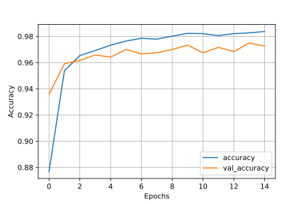
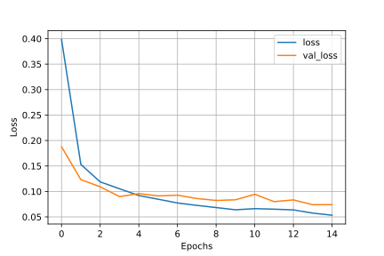

# maskiPy: Multi-class classifier to detect unmasked, improperly masked, and properly masked human faces.

### Overview:
Businesses have been increasingly trying to use Machine Learning solutions to maintain their foothold in the contemporary world ravaged by COVID-19. For instance, some food delivery platforms have deployed AI-driven systems, like the one [here](https://www.pyimagesearch.com/2020/05/04/covid-19-face-mask-detector-with-opencv-keras-tensorflow-and-deep-learning/), which detect if their delivery partner is wearing a mask. However, I often find the delivery partners wearing their face mask on the chin or mouth-chin that compromises consumer safety.

Maskipy improves upon such systems by performing multilabel classification of the face data not only to identify if someone is wearing a mask but also if they are wearing it correctly.

### Demo:


### Dataset:
The model was trained using the **[MaskedFace-Net dataset](https://github.com/cabani/MaskedFace-Net)** and the **[source dataset (Flickr-Faces-HQ)](https://github.com/NVlabs/ffhq-dataset)**, using which the MaskedFace-Net dataset has been generated. It was ensured that **faces weren't reused between the three classes (unmasked, improperly masked, properly masked) to ensure proper generalization.**

The classification model comprises of headless **[MobileNetV2](https://keras.io/api/applications/mobilenet/) on which a sequential keras model (Max Pool(7,7) > Flatten > Dense(ReLu, 128) > Dense(ReLu, 128) > Dense(Softmax, 3)) is stacked**. Since MobileNetV2 is a high-performance, low-latency model proficient in classification tasks designed for mobile devices, it fits the potential use case. Only the head is retrained to obtain the desired classification.

  
MobileNetV2 Architecture (Source: )

The driver file uses [OpenCV frontal face detector](https://github.com/opencv/opencv/blob/master/data/haarcascades/haarcascade_frontalface_default.xml) to extract face data from the camera feed. The model predicts the class based on the same that gets displayed on the screen above the bounding box(es).

### Installation and Usage:
* Clone the repository, create a new environment, if required, and install the required Python packages:
```
git clone https://github.com/anktsngh/maskipy.git
pip install -r requirements.txt
```
* Execute maskipy_driver.py file in Python3 passing in config.ini as an argument:
```
python maskipy_driver.py --config config.ini
```

To train a new model,
* Download and extract the dataset.zip. (If a larger dataset is needed, the same can be compiled from the sources (MaskedFace-Net dataset and Flickr-Faces-HQ) mentioned above and structured as in the dataset_sample included.)
```
wget https://dl.dropboxusercontent.com/s/ivn22i3kr1i9udq/dataset.zip && unzip dataset.zip -d dataset/
```
* Modify the config parameters as required and execute maskipy_train.py in Python3 passing in config.ini as an argument:
```
python maskipy_train.py --config config.ini
```

### Model Performance:

The classification report of the model is shown below:
```
                   precision    recall  f1-score   support
                   
improperly_masked       0.97      0.97      0.97       400
  properly_masked       0.98      0.97      0.98       400
         unmasked       0.99      0.99      0.99       400
         
         accuracy                           0.98      1200
        macro avg       0.98      0.98      0.98      1200
     weighted avg       0.98      0.98      0.98      1200
 
 ```
The model reported **F1-score greater than 0.97 across all the classes and overall accuracy of 98%** for a test set of 1200 images. I had assigned a slightly higher class weight to the properly masked for that resulted in slightly better performance. This can be tweaked in the label_weights parameter in the config.

The loss vs numEpochs and accuracy vs numEpochs plots are shown below:

 

It can be observed from the plots that the model displays **high accuracy and very little signs of overfitting**.
